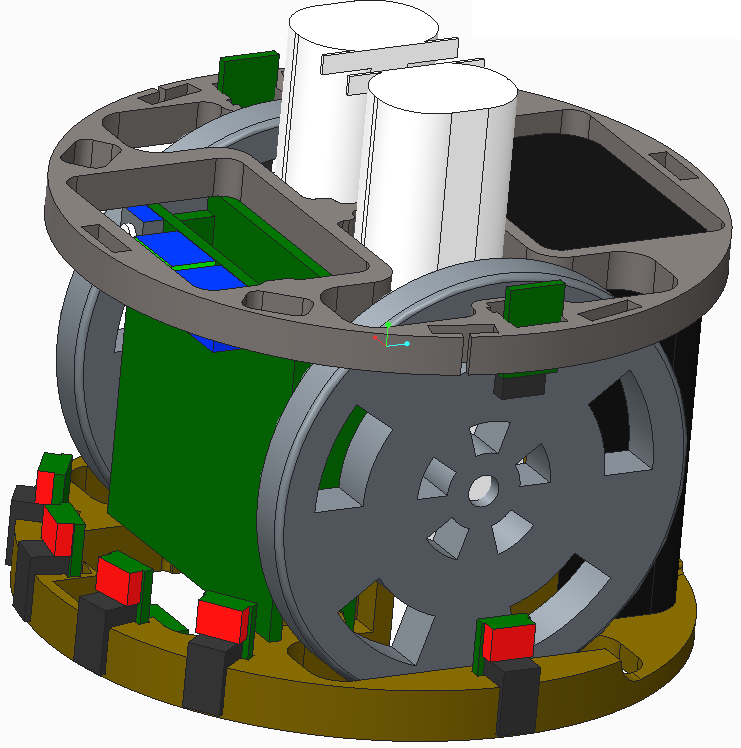
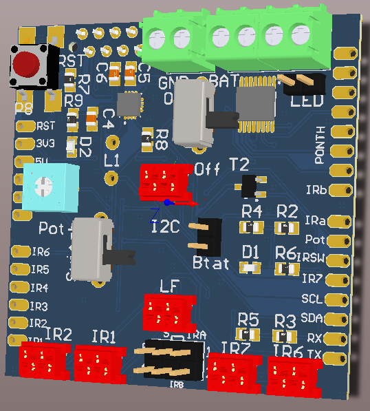
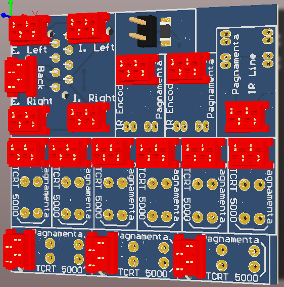

# mPuck

## Introduction

The mPuck was developed in order to create the smallest possible robot using the Kit PRisme 3 components. The design has now expanded in a cheap robotic platform that can be used o teach basic robot concepts such as line tracking, light tracking and obstacle avoidance. More advanced concepts are enabled by this design such as navigation (using odometry) and swarms of robots (they can communicate through BT and light). A single copy of this robot can be hand produced in less than 5 hours.  

### Characteristics

The robot (still in development) has:
* 6 analog IR sensors (on the sides) for obstacle avoidance
* 2 digital IR sensors (pointing the ground) for line tracking
* 2 digital IR sensors, which are used for odometry
* A bluetooth module
* A 108 pixels linear camera, for light source tracking
* A power (0.5 W) LED
* A switch, used for example to switch mode of operation
* An analog potentiometer
* Support for 2 DC motors (same as the kit PRisme 3)

## Assembly

The components of the robot are:
* 3D printed top (not final)
* 3D printed bottom (not final)
* 2 M3*56 mm bolts
* 2 Motors (same as kit PRisme 3)
* PRismino board
* mPuck dedicated shield
* mPuck dedicated sub-PCB
* micro match cables (to be defined)

	

Mounting instruction will be provided once the design is final

## Programming

The software is still in development. The idea is that basic functions to access the hardware will be provided, but the development of behaviors is left to the final user (who can then sen them to git).

## Licence

This work is published under [Creative Commons Attribution Share-Alike license](http://creativecommons.org/licenses/by-sa/3.0/).

